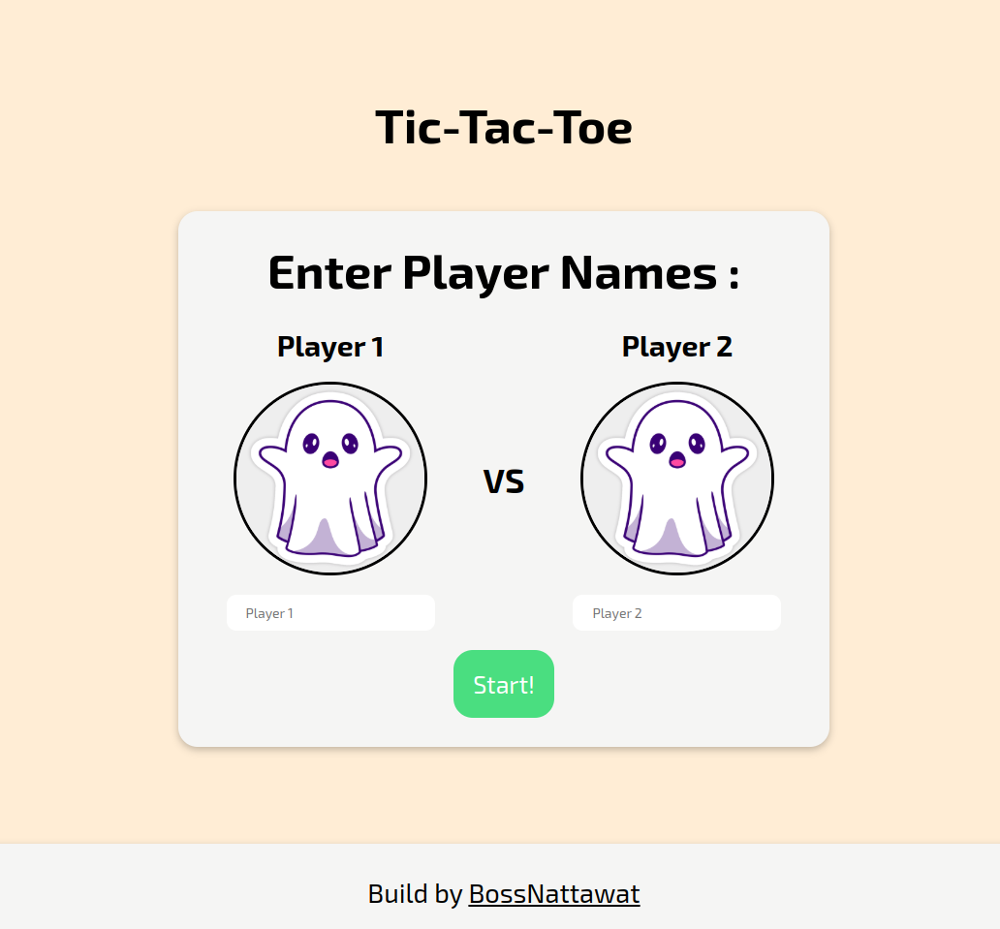
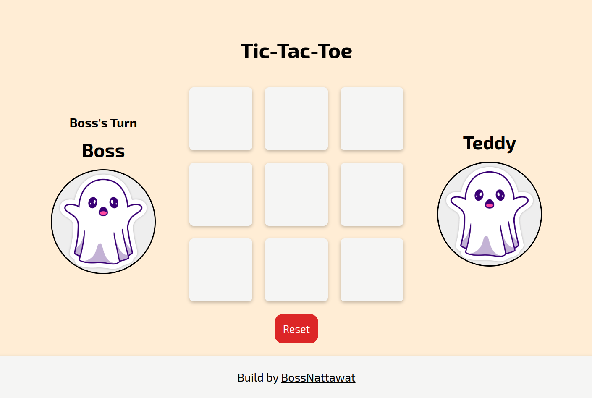

# Tic-Tac-Toe

### Link: [Tic-Tac-Toe](https://tic-tac-toe-sigma-lemon.vercel.app/)

A simple and interactive Tic-Tac-Toe game built using HTML, CSS, and JavaScript.

## Features

- Play a classic 2-player Tic-Tac-Toe game.
- Input player names for a personalized experience.
- Displays the current player's turn.
- Alerts when a player wins or when the game ends in a draw.
- Reset button to restart the game anytime.

## Demo




## Installation

1. Clone the repository:
    ```bash
    git clone https://github.com/BossNattawat/tic-tac-toe.git
    ```
2. Navigate to the project folder:
    ```bash
    cd tic-tac-toe
    ```
3. Open `index.html` in your browser to play the game.

## How to Play

1. Enter names for Player 1 and Player 2.
2. Click **Start!** to begin the game.
3. Players take turns clicking on the cells to mark their symbol (X or O).
4. The game announces a winner if a player aligns 3 symbols horizontally, vertically, or diagonally.
5. If all cells are filled without a winner, the game ends in a draw.
6. Use the **Reset** button to restart the game.

## Code Highlights

### HTML Structure
- The player input form and the game board are defined in `index.html`.

### JavaScript Logic
- Game state is maintained in a 2D array (`gameTable`).
- A `Player` constructor defines player attributes (name, mark).
- Event listeners handle user interaction and update the UI dynamically.

### CSS Styling
- `style.css` provides styling for a visually appealing game interface.

## Customization

- Replace `images/player.png` with your own player icons.
- Modify styles in `style.css` to change the game appearance.

## License

This project is licensed under the MIT License. Feel free to use and modify it as needed.
